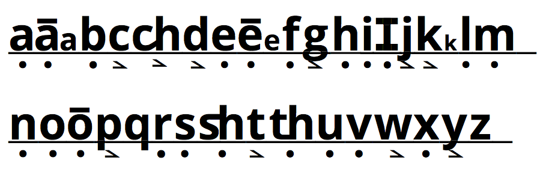
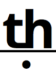
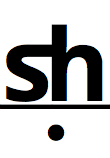
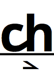
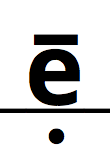
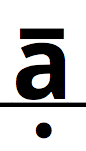
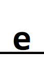
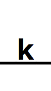

# Phonics based Fonts

This is a collection of open-source fonts you can use to create your own stories for kids learning to read using phonics-based methods. Phonic based methods have been shown to teach children to read faster, and with better comprehension, then other methods. The easiest way to start is with a one-to-one correspondence between the characters written, and the sounds they make. However, the 26 letters commonly used commonly in English writting cannot encode the 38 (or more) sounds used in English speaking. So to make it easier for children to learn to read, we can suplement the 26 English letters with 8 additional characters to represent common additional sounds. For example, the 'th' sound, 'sh', 'ch', and long vs short vowels.

## Quick Start
To use these fonts, simply download them to your computer and add them to your operating system. Then use a standard word processor to type your story using lower case letters. Use uppercase letters and other symbols to create the special characters

| Character | Example | How to create it |
| :-------: | :-----: | :--------------: |
|     |  **th**is |  `TH`   |
|     | **sh**ip |  `SH`   |
|     | **ch**at |  `CH` |
|  | th**e** | \` `e`    (backtick is on the   top right of your keyboard)|
|  | **a**te | \` `a` |
|     | littl**e** |  `E` |
|     | kic**k** | `K` |

### Copyright and License
Copyright 2017, Jay Dermody

Font and Website Content Licensed under the Apache License, Version 2.0

Derived from 'Open Sans', Digitized data copyright 2010-2011, Google Corporate, Licensed under Apache License, Version 2.0
